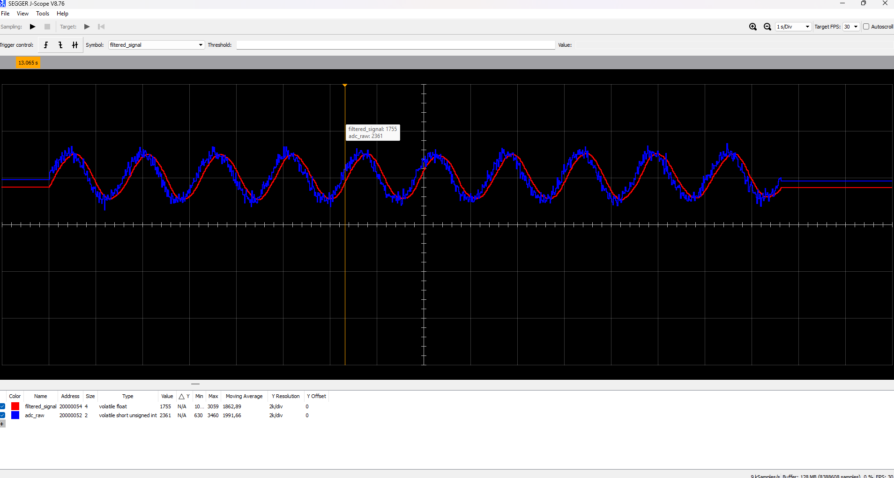

# PPG-Signal-Processing Device
Signal Processing designed for STM32f411re MCU for a complete medical device project 

# PPG Signal Processing Device

This repository contains the design and implementation of a **PPG Signal Processing Device** with heart rate (HR) and SpO2 computation, battery alarm, and data logging functionality. The project is structured into modular components, represented in a multi-level DeMarco functional diagram.

A modular implementation of a **PPG-based signal processing system** running on an STM32F411RE MCU, featuring:

- Digital filtering  
- Heart Rate (HR) computation  
- SpO₂ computation  
- Battery level monitoring & alarm  
- Data logging to SD card  
- Extensible architecture for WiFi/MQTT/WebApp integration  

The architecture follows a **multi-level DeMarco functional diagram** for clarity and future scalability.

---

## 🛠 Development Tools

This project is developed using the following hardware and software stack:

### **Hardware**
- **STM32F411RE** (Nucleo board) — main MCU for signal processing  
- **PPG Sensor** (MAX30102 or compatible, planned)  
- **SEGGER J-Link** — debugging & J-Scope signal visualization  
- **SD Card Module via SPI** — data logging  

### **Software**
- **STM32CubeMX** — peripheral initialization  
- **VS Code + Cortex-Debug + ARM Toolchain** — development environment  
- **Python 3.9.13** — synthetic data generation and offline analysis  
- **SEGGER J-Scope** — real-time visualization of filtered signal  
- **draw.io / diagrams.net** — system diagrams  

---

## 📈 Real-Time Filtering Preview (STM32 + J-Scope)

Example of filtered PPG waveform captured during firmware testing:



---
## 🏗 Getting Started

### 1. STM32 Project Build

```bash
# Navigate to project folder
cd HR_SPO2_computing_dev

## Build project

# 1. cmd prompt

# - If you want to compile in Simulation
    cmake --build --preset SimulatedDebug

# - If If you want to compile
    cmake --build --preset Debug

# 2.  VScode 

# - Command Palette

# - CMake: Select Configure Preset

    # choose SimulatedDebug or Debug

# - Cmake: Configure Preset

# - play build

# - NB.: Use lounch.json inside .vscode to Debug (Do not overite !!)
```
# Debug

 - Op1: Download MCU drivers for Jlink and Jlink compatible tools for STM32F411RE

 - Op2: Download STLINK and STM32CubeIDE

 - Download arm-cortex toolchain as compiler

# For VSCODE + Op1 suggestion

 - Download:
    - STM32CubeIDE extention for vscode 
    - C/C++ Intellisense
    - CMake Tools
    - Cortex - Debug

 - Create workspace in vscode inside "HR_SPO2_computing_dev" folder

 - Open cmd prompt in the MCU project is located and type
   ```bash
   # Windows
   code HR_SPO2_computing_dev.worspace
   ``` 
   to open the project in vscode
     

### PYTHON ENVIRONMENT

```bash
# - Install Python 3.9.13

# - create a venv 
    python -m venv SPO2_project_venv venv 

# - activate venv
    cd SPO2_project_venv\Scripts
    activate

# install requirements
    pip install -r requirements.txt

```

## Diagrams

### Level 0: System Context


**Overview:**  
Shows the overall system, including the PPG sensor, battery, user interface, and the main processing module. This level highlights the interaction between the device and external entities.

---

### Level 1: Main Processes


**Overview:**  
Illustrates the three main modules of the system:
1. **HR/SpO2 Computation** – processes raw PPG signals to compute heart rate and oxygen saturation.  
2. **Battery Alarm** – monitors battery level and triggers alerts when low.  
3. **Data Logger** – stores processed HR/SpO2 data for later use.

---

### Level 2: HR/SpO2 Computation Module


**Components:**  
- **PPG Signal Input** – receives raw sensor data.  
- **Digital Filtering** – applies moving average or other filters to clean the signal.  
- **Feature Extraction** – calculates heart rate and oxygen saturation values.  
- **Output Data Flow** – sends computed HR/SpO2 values to the Data Logger module.

---

### Level 2: Battery Alarm Module


**Components:**  
- **Battery Monitor** – reads battery voltage level.  
- **Threshold Detection** – compares current voltage with predefined threshold.  
- **Alert Generation** – triggers notifications to the user or device interface when battery is low.

---

### Level 2: Data Logger Module


**Components:**  
- **Data Logger Manager** – receives HR/SpO2 data and formats it for storage.  
- **SPI Manager** – manages SPI communication to write data to SD card.  
- **SD Card Storage** – stores data in **JSON format**, lightweight and suitable for future integration with HL7 standards or web applications.

**Data Flow:**  

## Project Structure of STM32 MCU

```
HR_SPO2_computing_dev/
├───.vscode
├───cmake/
│   └───stm32cubemx
├───Core/
│   ├───Inc
│   │       battery_monitor.h
│   │       FreeRTOSConfig.h
│   │       main.h
│   │       ppg_processing.h
│   │       stm32f4xx_hal_conf.h
│   │       stm32f4xx_it.h
│   └───Src
│           battery_monitor.c
│           freertos.c
│           main.c
│           ppg_processing.c
│           stm32f4xx_hal_msp.c
│           stm32f4xx_hal_timebase_tim.c
│           stm32f4xx_it.c
│           syscalls.c
│           sysmem.c
│           system_stm32f4xx.c
├───Drivers/
│   ├───CMSIS/
│   │   ├───Device/ST/STM32F4xx
│   │   │   ├───Include
│   │   │   └───Source/Templates
│   │   └───Include
│   └───STM32F4xx_HAL_Driver/
│       ├───Inc
│       └───Src
├───FATFS/
│   ├───App
│   └───Target
└───Middlewares/
    └───Third_Party
        ├───FatFs/src/option
        └───FreeRTOS/Source
            ├───CMSIS_RTOS_V2
            ├───include
            └───portable
                ├───GCC/ARM_CM4F
                └───MemMang

```
